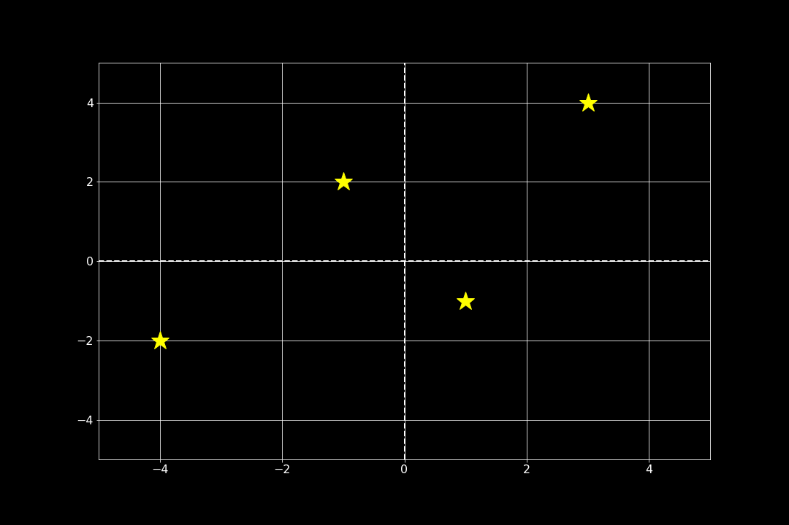
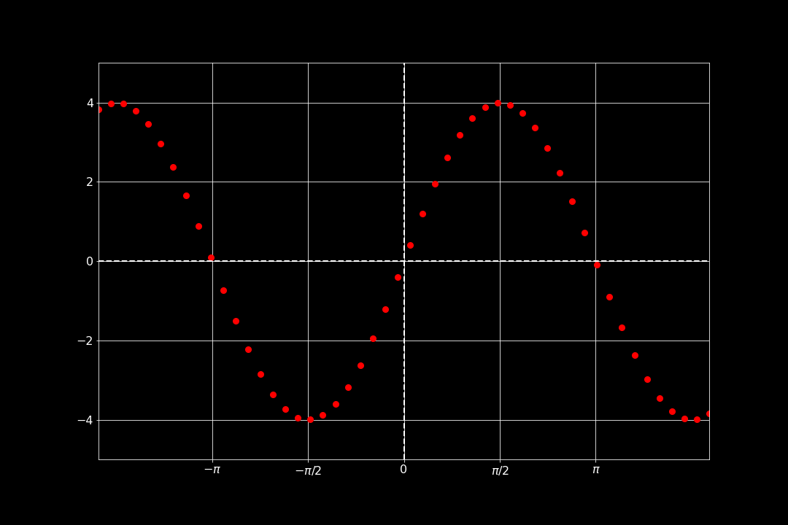
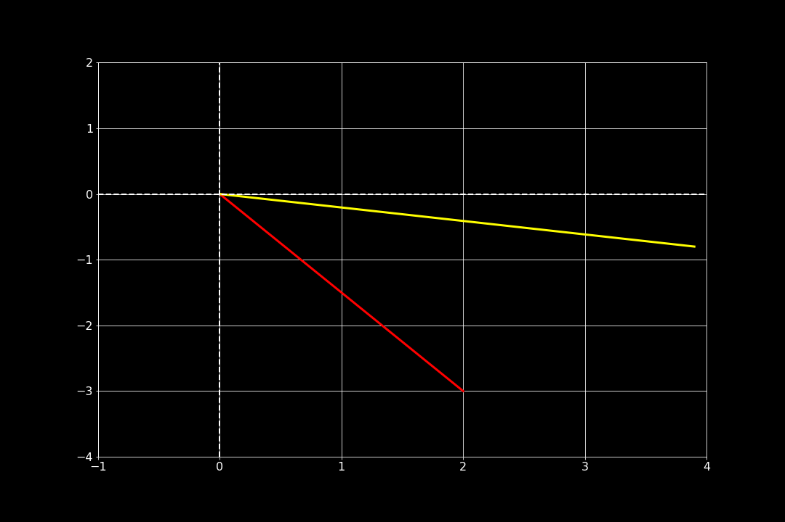
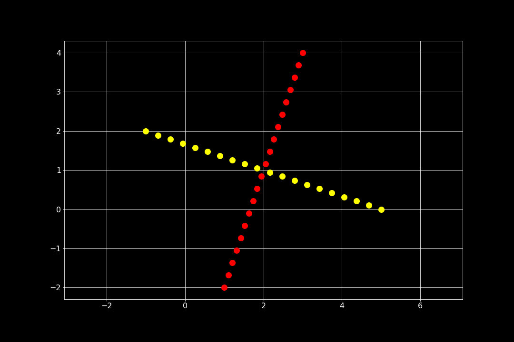
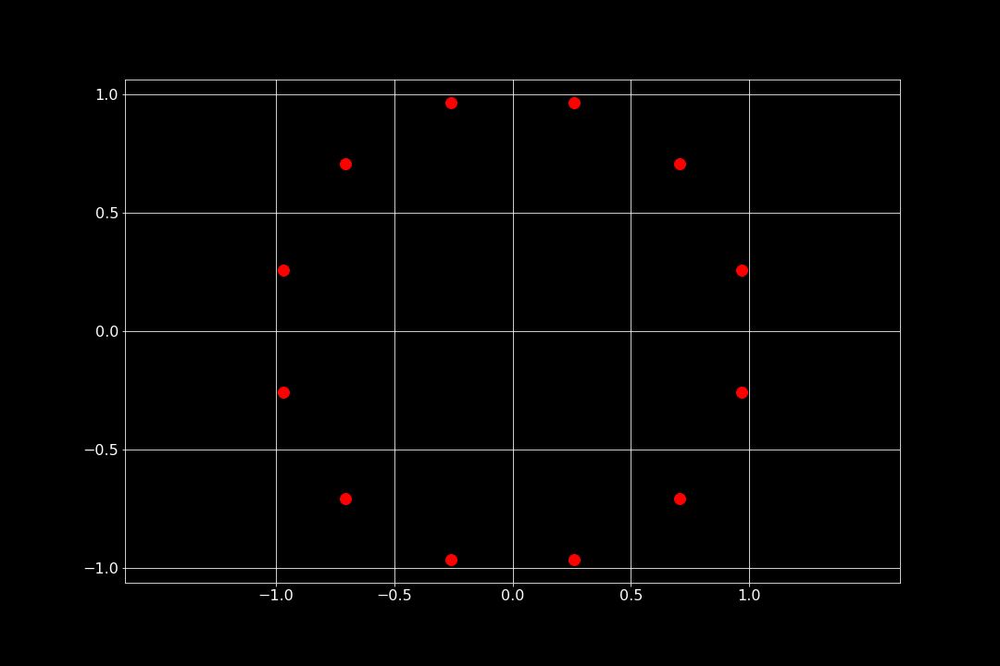

# Pusselbitar i Python - Grafisk representation

Detta dokument innehåller exempel på Pythonkod som har med hantering av grafer att göra. Tillhörande övningsuppgifter finns [i sektionen Uppgifter](#uppgifter).

Det finns två bibliotek som är viktiga att importera i samband med nästan allt arbete med linjär algebra i Python: `numpy` och `matplotlib`. Dessa importeras med

```python
import numpy as np
import matplotlib.pyplot as plt
```

Dessa båda bibliotek innehåller funktioner som hanterar t ex matrisberäkningar (`numpy`) respektive grafisk representation av t ex funktioner och vektorer (`matplotlib`). Dessa rader behöver stå med i början av varje program; när de är inlästa så finns funktionerna tillgängliga med prefixen `np` respektive `plt`.

I detta inlägg kommer jag att fokusera på några av funktionerna i `matplotlib`, ett tidigare inlägg ger exempel på hur vektorer och matriser hanteras.

## Skapa punkter

Det mest grundläggande som har med grafik att göra är kanske de enskilda punkterna. I Python kan några punkter skapas på detta sätt:

```python
px = np.array([-4, -1, 1, 3]) # x-värden för respektive stjärna
py = np.array([-2, 2, -1, 4]) # y-värden för respektive stjärna
lower_x = -5; upper_x = 5
lower_y = -5; upper_y = 5

plt.plot(px, py, '*', color='yellow', markersize=26)
plt.plot([lower_x, upper_x], [0, 0], color='white', linewidth=2, linestyle='--')
plt.plot([0, 0], [lower_y, upper_y], color='white', linewidth=2, linestyle='--')

plt.xlim([lower_x, upper_x])
plt.ylim([lower_y, upper_y])
plt.grid()
plt.show()
```



Vi ser att en punkt landar på respektive angiven koordinat. Observera att x-koordinaterna är angivna för sig i en vektor, och att motsarande gäler för y-koordinaterna.

## Visa funktioner

För att visa funktionsgrafer blir det lite jobbigt att manuellt ange alla punkter som behövs. Ofta så kan man skapa en vektor som innehåller ett stort antal x-värden, och sedan ange en funktion som dessa ska avbildas på.

```python
px = np.linspace(-5, 5, 50) # 50 x-värden mellan -5 och 5
py = 4*np.sin(px) # Själva funktionen
lower_x = -5; upper_x = 5 # Används nedan för att ange var x-aceln börjar och slutar
lower_y = -5; upper_y = 5 # Dito för y-axeln

# Nedan plottas själva funktionen som (ganska stora) punkter.
# px och py är vektorer som är beräknade ovan.
plt.plot(px, py, '.', color='red', markersize=16)

# På följande två rader plottas x- och y-axeln ut. Det är enbart för
# estetikens skull.
plt.plot([lower_x, upper_x], [0, 0], color='white', linewidth=2, linestyle='--')
plt.plot([0, 0], [lower_y, upper_y], color='white', linewidth=2, linestyle='--')

plt.xlim([lower_x, upper_x]) # x-axelns gränser
plt.ylim([lower_y, upper_y]) # y-axelns gränser
plt.grid()

# Anpassade markeringar på x-axeln
plt.xticks([-np.pi,-np.pi/2,0,np.pi/2,np.pi],
           ['$-\pi$','$-\pi/2$',0,'$\pi/2$','$\pi$'])
plt.show()
```

Resultatet av koden ovan blir 50 punkter som formerar sig efter en sinusfunktion.



## Vektorer

Vi är ju vana vid att se vektorer som pilar, men det är inte helt lätt att få till i Python. Därför är det vanligt att i vissa sammanhang illustrera dem som linjer istället, vilket också görs här.

```python
vx = np.array([0, 2])  # Vektorns start- och slutpunkt i x-led
vy = np.array([0, -3]) # Vektorns start- och slutpunkt i y-led

lower_x = -1; upper_x = 4
lower_y = -4; upper_y = 2

trans_mat = np.array([[1.2, -0.5], [0.5, 0.6]]) # En avbildningsmatris

trans_v = (trans_mat@([vx[1], vy[1]])) # Här sker själva avbildningen

# Urssprungsvektorn plottas
plt.plot(vx, vy, '-', color='red', linewidth=3)

# Vektorn som blir resultatet då utsprungsvektorn avbildas
# enligt matrisen ovan plottas
plt.plot([0, trans_v[0]], [0, trans_v[1]], linewidth=3, color='yellow')

# Koordinataxlar
plt.plot([lower_x, upper_x], [0, 0], color='white', linewidth=2, linestyle='--')
plt.plot([0, 0], [lower_y, upper_y], color='white', linewidth=2, linestyle='--')

plt.xlim([lower_x, upper_x])
plt.ylim([lower_y, upper_y])
plt.grid()
plt.show()
```

Resultat ser vi nedan, den röda linjen är "ursprungsvektorn" (som är $\begin{bmatrix}2\\-3 \end{bmatrix}$) och den gula är resultatet då denna avbildas enligt reglerna som matrisen anger. Den definierade marisen är $\begin{bmatrix}1.2&-0.5\\0.5&0.6 \end{bmatrix}$, som är vald helt på måfå för att få till en tydlig vridning och en förlängning av ursprungsvektorn.



## Räta linjens ekvation

Den sista pusselbiten i det här inlägget är räta linjens ekvation. Som du kanske minns så kan den anges på flera olika sätt, och det sätt som ska användas här är med en definierad riktningsvekor och en parameter. Dessutom ritas en normalvektor till linjen ut. Resultatet representeras som punkter som ligger på respektive linje (den som motsvaras av riktningsvektorn och dess normal).

```python
v = np.array([1, 3]) # Riktingsvektor
vn = np.array([-v[1], v[0]]) # Normalvektor

r0 = np.array([2, 1]) # Motsvarar punkten då t = 0

# Skapar 20 jämnt fördelade värden på t mellan -1 och 1
for t in np.linspace(-1, 1, 20):
    line = r0+t*v # Generera linjen genom r0 med normalvektorns riktning
    normal = r0+t*vn # Generera normalen genom r0

    # Punkter på linjen plottas
    plt.plot(line[0],line[1], 'ro', markersize=12, color='red')

   # Punkter på normalen plottas
    plt.plot(normal[0],normal[1], 'bo', markersize=12, color='yellow')

# För att linjerna ska se vinkelräta ut så måste det vara samma avstånd mellan
# enheterna på x- och y-axeln. Detta gäller även när andra figurer ska avbildas
# och proportionerna är viktiga (t ex för cirklar).
plt.axis('equal')

plt.grid()
plt.show()
```

Parametern som används är `t` och den löper i 20 steg mellan -1 och 1 (kontrollera antalet punkter på respektive linje!).



## Uppgifter

Lös uppgifterna nedan i ett Jupyter- eller [colab-dokument](https://colab.research.google.com).

1. Lägg "manuellt" ut ett antal punkter som bildar ditt namns initaler.

2. Experimentera med grafen för sinusfunktionen ovan genom att ändra antalet och storleken på punkterna.

3. Rita punkter som ligger utefter funktionen $y=5-e^{-0.2x}$ ochs som visas mellan $-10\leq x \leq 10$.

4. Experimentera med punkterna på [Räta linjens ekvation](#räta-linjens-ekvation) ovan. Ändra riktningsvektorn och försök att variera punkternas täthet utan att linjernas utsträckning ökar.

5. Deklarera en **rotationsmatris**, alltså en matris som enbart vrider en vektor utan att förändra dess längd, på motsvarande sätt som i sektionen [Vektorer](#vektorer) ovan. Förvissa dig om att den fungerar som den ska. OBS! vinklar anges i radianer. Som extrauppgift kan du skriva en funktion som omvandlar grader till radianer så att det går att ange en vridning på ett enkelt sätt för dem som är ovana vid radianer.

6. Använd din rotationsmatris som du skapat ovan för att rita ett antal punkter som ligger på en cirkel, som t ex nedanstående figur. Tips: Se punkterna som vektorer. Välj var den första punkten ska skapas någonstans. Därefter så tillämpas rotationsmatrisen för ren given vinkel (t ex $\pi/6$) på vektorn (som ju representeras av en punkt) för att få läget för nästa punkt. Gör det som en loop, ungefär som i sektionen [Räta linjens ekvation](#räta-linjens-ekvation).

   

7. I sektionen [Skapa punkter](#skapa-punkter) skapas något som ser ut som en stjärnhimmel. Skapa stjärnor på slumpvis valda lägen (t ex 50 stjärnor) i koordinatsystemet. Precis som riktiga stjärnor så ska de variera i storlek och färg på ett lämpligt sätt. För att få den mörka bakgrunden kan följande rad deklareras i samband med `import`-satserna överst: `plt.style.use('dark_background')`.
